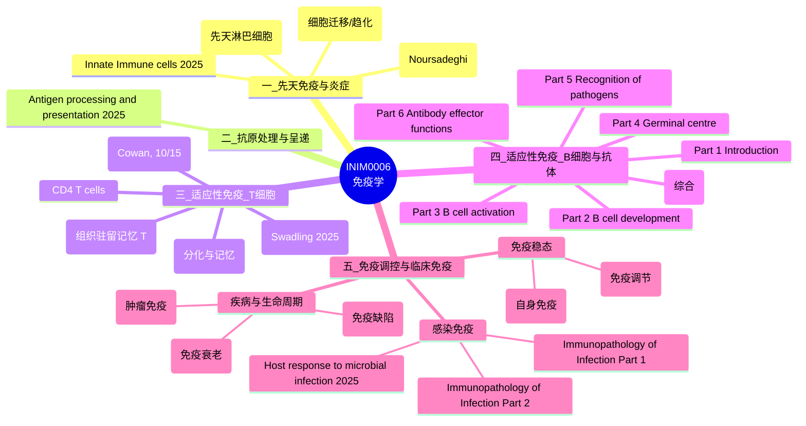

# INIM0006 免疫学课程 — 文件思维导图

> 本课程考核：2 小时线下笔试。
> 下面把 27 份课件按"免疫学知识体系"分成 **5 大类**，方便系统复习。

---

## 一、Mermaid Mind Map（可视化思维导图）

---

## 二、分类大纲（带文件清单）

### 🟦 一、先天免疫与炎症（Innate Immunity & Inflammation）
> 第一道防线：识别 PAMPs/DAMPs，引发炎症与早期清除。

| 文件 | 关键内容 |
|---|---|
| `INIM0006-2025_InnateImmuniyInflammation_Noursadeghi.pptx` | 先天免疫总论、炎症通路 |
| `Innate Immune cells _2025.pdf` | 中性粒、单核/巨噬、DC、NK 等细胞 |
| `ILCs.pdf` | 先天淋巴细胞 ILC1/2/3 |
| `Cell_migration.pdf` | 趋化因子、白细胞迁出与归巢 |

---

### 🟩 二、抗原处理与呈递（Antigen Processing & Presentation）
> 连接先天与适应性免疫的桥梁。

| 文件 | 关键内容 |
|---|---|
| `Antigen processing and presentation_2025.pdf` | MHC I / II 通路、交叉呈递 |

---

### 🟥 三、适应性免疫 — T 细胞（Adaptive Immunity: T cells）
> 细胞免疫主力：发育 → 活化 → 分化 → 记忆。

| 文件 | 关键内容 |
|---|---|
| `15th October Cowan Basic T cell development.pptx` | 胸腺发育、阳性/阴性选择 |
| `CD4 T cells.pdf` | Th1/Th2/Th17/Tfh/Treg 亚群 |
| `CD8 and Trm.pdf` | 细胞毒性 T 与组织驻留记忆 T |
| `T cell diffmem.pdf` | 效应/记忆 T 分化 |
| `F2F_T cell diffmem_Swadling_2025_slides (1) - Tagged.pdf` | 同主题面授版 (2025) |

---

### 🟧 四、适应性免疫 — B 细胞与抗体（B cells & Antibodies）
> 体液免疫主力：6 个 Part 系统讲解 + 综合复习。

| 文件 | 关键内容 |
|---|---|
| `B cells and antibodies - Part 1 Introduction (1).pptx` | B 细胞与抗体导论 |
| `B cells and antibodies - Part 2 B cell development.pptx` | 骨髓中 B 细胞发育、BCR 重排 |
| `B cells and antibodies - Part 3 B cell activation.pptx` | T 依赖 / 不依赖活化 |
| `B cells and antibodies - Part 4 Germinal centre.pptx` | 生发中心、SHM、亲和力成熟、类别转换 |
| `B cells and antibodies - Part 5 Recognition of pathogens.pptx` | 抗体识别病原模式 |
| `B cells and antibodies - Part 6 Antibody effector functions.pptx` | 中和、调理、ADCC、补体激活 |
| `B cell function .pdf` | B 细胞功能综合 PDF |

---

### 🟪 五、免疫调控与临床免疫（Regulation & Clinical Immunology）

#### 5.1 免疫稳态
| 文件 | 关键内容 |
|---|---|
| `Immune regulation.pdf` | Treg、抑制性受体、外周耐受 |
| `Autoimmunity.pdf` | 自身免疫病机制（SLE、RA、T1D 等） |

#### 5.2 感染免疫
| 文件 | 关键内容 |
|---|---|
| `Host response to microbial infection - 2025.pdf` | 宿主对细菌/病毒/寄生虫反应 |
| `Immunopathology of Infection Part 1_2025.ppt` | 感染相关免疫病理 (上) |
| `Immunopathology of Infection Part 2_2025.ppt` | 感染相关免疫病理 (下) |

#### 5.3 疾病与生命周期
| 文件 | 关键内容 |
|---|---|
| `Immunodeficiency.pdf` | 原发性 / 继发性免疫缺陷 |
| `CancerImmunology.pdf` | 肿瘤免疫监视、免疫检查点治疗 |
| `AgeingImmunity.pdf` | 免疫衰老 (immunosenescence) |

---

## 三、复习建议路线（Suggested Study Path）

1. **打地基**：先天免疫 (一) → 抗原呈递 (二)
2. **建主干**：T 细胞 (三) → B 细胞 (四) → 生发中心 / 抗体功能
3. **理调控**：免疫调节 → 自身免疫 → 免疫缺陷
4. **看应用**：感染免疫 → 肿瘤免疫 → 免疫衰老

> 提示：**抗原呈递 (二)** 是连接先天与适应性免疫的关键节点；**生发中心 (四-Part 4)** 是 B 细胞最常考的核心。
