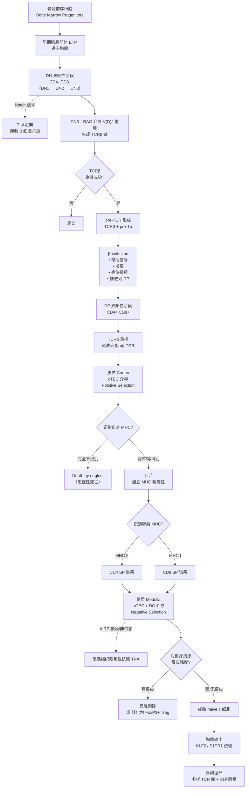

# T Cell Development in the Thymus — Flow Diagram

> 根据描述整理：T 细胞从骨髓前体到成熟 naive T 细胞输出的完整发育流程。

---

## 主流程图

---

## 关键节点速记表

| 阶段 | 位置 | 关键事件 | 关键分子 |
|---|---|---|---|
| 进入胸腺 | 骨髓 → 胸腺 | ETP 迁入 | — |
| DN1–DN3 | 皮质外缘 | T 系定向 | **Notch** |
| DN3 | 皮质 | TCRβ V(D)J 重排 | **RAG1/2** |
| β-selection | 皮质 | pre-TCR 信号 → 存活/增殖/等位排斥 | **pre-Tα + TCRβ** |
| DP | 皮质 | TCRα 重排，完整 αβ TCR | RAG |
| 阳性选择 | 皮质 | 弱/中识别 self-MHC → 存活；否则 death by neglect；建立 MHC 限制 | **cTEC** |
| 谱系决定 | 皮质 | MHC II → CD4 ；MHC I → CD8 | — |
| 阴性选择 | 髓质 | 强自反应性 → 删除 或 → Treg | **mTEC + DC，AIRE，FoxP3** |
| 输出 | 髓质 → 外周 | 胸腺出口 | **KLF2 → S1PR1** |

---

## 三大检查点（Three Checkpoints）

1. **β-selection（DN3 → DP）**：检查 TCRβ 重排是否成功 → 决定能否继续发育。
2. **Positive selection（皮质，DP）**：检查 TCR 是否能识别 self-MHC → 建立 **MHC 限制性**。
3. **Negative selection（髓质，SP）**：检查是否对 self-Ag 过度反应 → 建立 **中枢耐受**。

> 核心逻辑：**多样性（V(D)J 随机重排）→ 有用性（阳性选择）→ 安全性（阴性选择）**，最终输出既能识别外来抗原、又不攻击自身的成熟 T 细胞。
